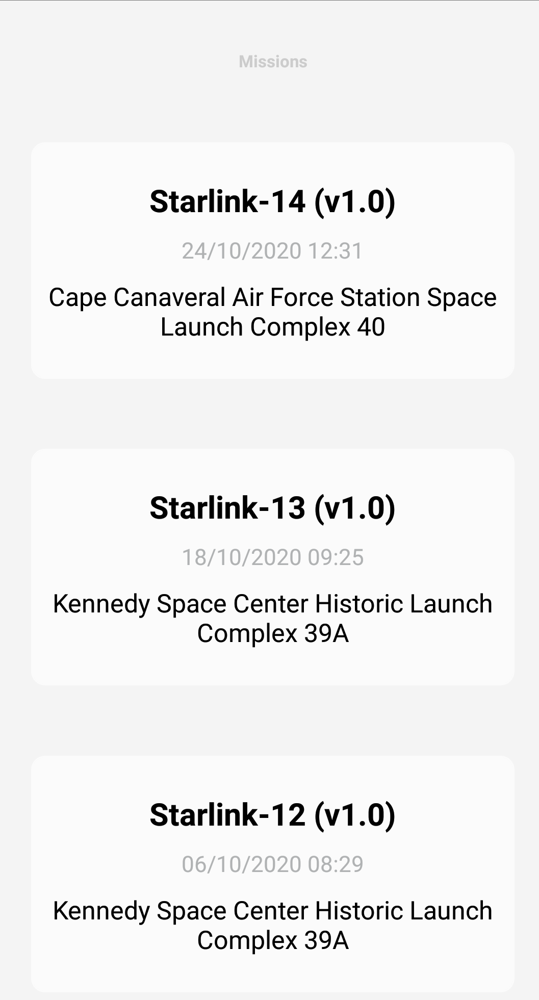
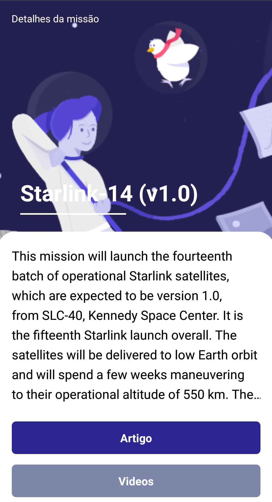

# SPACE X 

[](https://github.com/VictorHCord/mobile-spacex)
[](https://github.com/VictorHCord/mobile-spacex)

<br>
O Aplicativo você poderá verificar as missões realizada pelo space x.
Poderá ver detalhes das missões entra em artigos ou videos sobre o que 
ocorreu em cada missão e o que falaram sobre.
<br>
<br>

## Para que esse projeto serve ?
Criei esse projeto para aprender alguns conceitos e frameworks referente ao react/react-native.
<br>
Também queria testar minha como funcion o [GraphQL](https://graphql.org/) junto do [Apollo](https://www.apollographql.com/docs/)

## Instalação

- Clone o projeto na sua área de trabalho
<br>

- Instale as dependencias com o comando: 

```
yarn install
```
ou

```
npm install
```

- Com projeto clonado e as dependencias instaladas, voce deve rodar o comando:

``` 
yarn android
```
- Observação: Antes de utilizar esse comando certifique-se que o [Android Studio](https://developer.android.com/) esteja instalado.

<br>

## :computer: Tecnologias

- React Native
- Styled components
- GraphQL
- Apollo
- Typescript
- ESlint
- Prettier
<br>
<br>

## Telas do aplicativo

<div>



</div>
<br>
